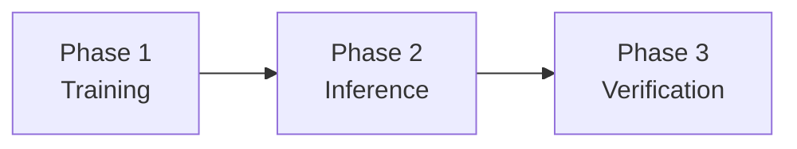
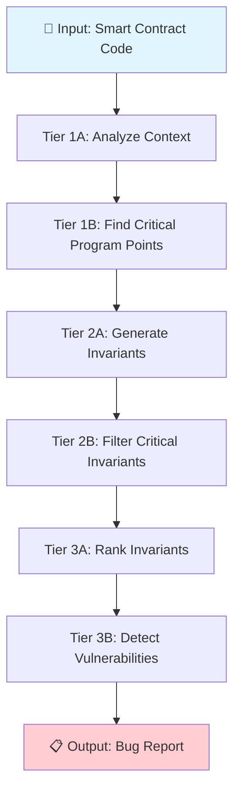
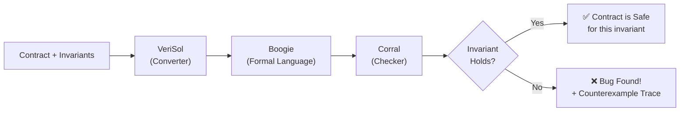

# 📖 Part 3: How SmartInv Works — The Complete Methodology

> This is the **heart of your presentation**. Understand this and you can explain the entire paper.

---

## The SmartInv Pipeline — Bird's Eye View

SmartInv works in **three main phases**:



| Phase | What Happens | Simple Analogy |
|---|---|---|
| **Phase 1: Training** | Teach the AI what invariants look like | Teaching a medical student about diseases |
| **Phase 2: Inference** | AI analyzes a new contract and generates invariants | The doctor examines a new patient |
| **Phase 3: Verification** | Mathematically check if the contract violates the invariants | Running lab tests to confirm the diagnosis |

---

## Phase 1: Training the AI

### Step 1.1 — Collecting the Dataset

Before the AI can find invariants, it needs to **learn what invariants look like**. The researchers manually created a dataset by:

1. **Collecting real smart contracts** from Ethereum (80,000+ contracts from Etherscan)
2. **Manually writing invariants** for each contract (this took enormous human effort)
3. **Labeling** each invariant with:
   - Which program point it belongs to
   - Whether it's a critical invariant
   - What the transaction context is
   - What vulnerabilities it prevents

**The dataset format looks like this:**

| Contract | All Invariants | Critical Program Points | Critical Invariants |
|---|---|---|---|
| TokenSwap.sol | invariant 1, 2, 3... | Line 15, Line 22 | invariant 2 (prevents drain) |

> [!NOTE]
> The researchers created **2,000+ annotated invariant samples** across multiple datasets. This manual work is what makes the AI actually useful — garbage in, garbage out.

### Step 1.2 — Creating Tier of Thought (ToT) Training Data

The regular dataset just says "here's a contract, here are its invariants." But for ToT, the researchers created **structured multi-step training data** where each contract has 6 question-answer pairs:

**Example for a simple contract:**

```
Contract:
    function foo(uint x) public returns (uint ret) {
        ret = x + 2;
    }
```

| Step | Question (Prompt) | Answer (Completion) |
|---|---|---|
| Tier 1A | "What's the transaction context?" | "Cross-function" |
| Tier 1B | "What are the critical program points?" | "Line 7" |
| Tier 2A | "What are the invariants?" | `7+ assert(y == x + 2)` |
| Tier 2B | "What are the critical invariants?" | `7+ assert(y == x + 2)` |
| Tier 3A | "What are the ranks?" | `7+ assert(y == x + 2)` |
| Tier 3B | "What are the vulnerabilities?" | "healthy" (no bugs) |

The final ToT dataset has **3,000+ training samples** in this structured format.

### Step 1.3 — Fine-tuning the AI Model

The researchers took **LLaMA-7B** (Meta's open-source AI model with 7 billion parameters) and fine-tuned it on the ToT dataset:

```
Base Model: LLaMA-7B (general knowledge)
         ↓ Fine-tune with ToT data
Specialized Model: SmartInv-LLaMA (smart contract expert)
```

**They used PEFT/LoRA** (Parameter-Efficient Fine-Tuning) which means:
- They didn't change the entire 7-billion-parameter model
- They only added small adapter layers (~few million parameters)
- This makes training faster and needs less GPU memory
- A single NVIDIA V100 or A100 GPU is enough

**Multiple models were fine-tuned and compared:**
- PEFT-LLaMA (best performer overall)
- Alpaca-LLaMA
- Full LLaMA with CoT
- GPT-2
- T5
- OPT-350M

---

## Phase 2: Inference (Analyzing a New Contract)

> This is where the magic happens. Given a **brand new** smart contract that the AI has never seen before, SmartInv figures out the invariants.

### The Tier of Thought (ToT) Process — Step by Step

This is the **core innovation** of the paper. Let me walk you through it in complete detail.

#### 🔵 Tier 1A: Understand the Context

**Question asked to the AI:**
> "Here is the contract [code]. What's the transaction context of the contract?"

**What the AI figures out:**
- Is this a single-function or cross-function contract?
- Does it involve arithmetic operations?
- Does it have external calls to other contracts?
- What's the overall business logic? (lending, trading, governance, etc.)

**Why this matters:** Knowing the context helps the AI focus on the right kind of invariants. A lending contract needs different invariants than a token contract.

#### 🔵 Tier 1B: Find Critical Program Points

**Question asked to the AI:**
> "Given the transaction context [from Tier 1A], what are the critical program points?"

**What the AI figures out:**
- Which specific lines of code are security-sensitive?
- Where are the money transfers?
- Where are the access control checks?
- Where do state variables change?

**Output example:** "Critical program points are Line 15, Line 23, Line 41"

#### 🟢 Tier 2A: Generate Invariants

**Question asked to the AI:**
> "Given the critical program points [from Tier 1B], what are the invariants?"

**What the AI generates:**
```
Line 15: assert(balance_after >= balance_before);
Line 23: assert(msg.sender == owner);
Line 41: assert(totalSupply == old_totalSupply);
```

**This is multimodal because:** The AI uses both the code AND its understanding of the natural language context (what the contract is supposed to do) to generate these invariants.

#### 🟢 Tier 2B: Identify Critical Invariants

**Question asked to the AI:**
> "Given the invariants [from Tier 2A], what are the critical invariants?"

**What happens:** Not all invariants are equally important. Some are trivially true (like `x == x`). The AI filters and keeps only the invariants that, if violated, would indicate a real security problem.

#### 🔴 Tier 3A: Rank Critical Invariants

**Question asked to the AI:**
> "Given the critical invariants [from Tier 2B], what are the ranks?"

**What happens:** The most security-critical invariants get ranked higher. This helps prioritize which bugs to investigate first.

#### 🔴 Tier 3B: Detect Vulnerabilities

**Question asked to the AI:**
> "What are the vulnerabilities in the contract?"

**Output:** Either "healthy" (no bugs) or a description of the vulnerabilities found.

### Complete Tier of Thought Flow Diagram



### Why Does ToT Work Better Than Regular Prompting?

| Approach | What happens | Accuracy |
|---|---|---|
| **Naive prompt** | "Find bugs in this code" | Very low — AI gives vague answers |
| **Chain of Thought** | "Think step by step to find bugs" | Better, but still unfocused |
| **Tier of Thought** | Structured 6-step process, each building on the last | Best — mimics human expert reasoning |

> [!IMPORTANT]
> The ablation study proved this: **Removing ToT caused a 65% drop in accuracy and 66% drop in F1-score.** ToT is THE most important component of SmartInv.

---

## Phase 3: Verification

After the AI generates invariants, SmartInv **mathematically verifies** them using formal methods.

### How Verification Works



**Step by step:**
1. The smart contract + inferred invariants are fed to **VeriSol** (Microsoft's Solidity verifier)
2. VeriSol converts the Solidity code to **Boogie** (a formal verification language)
3. **Corral** (a bounded model checker) checks if the invariants hold for all possible executions up to a certain depth
4. If an invariant is violated, Corral produces a **counterexample trace** — a step-by-step sequence showing exactly how a hacker could trigger the bug

### What is a Counterexample Trace?

A proof that the bug is real. It's like saying:
> "I found that if you do Step 1: call deposit(100), then Step 2: call withdraw(200), then Step 3: call transfer(50) — the invariant `balance >= 0` is violated at Step 2."

This is extremely valuable because it's not just "there might be a bug" — it's **"here's exactly how to reproduce it."**

---

## Heavy Mode vs. Light Mode

SmartInv has two modes of operation:

| Feature | Heavy Mode | Light Mode |
|---|---|---|
| **AI Model** | Fine-tuned PEFT-LLaMA (local) | GPT-4 (OpenAI API) |
| **GPU Needed?** | Yes — A100 or V100 | No — runs via API call |
| **Accuracy** | Higher (specialized model) | Good (but non-deterministic) |
| **Speed** | Depends on your GPU | Depends on API latency |
| **Cost** | Free (if you have GPU) | Costs money (OpenAI API) |
| **Best For** | Research, batch analysis | Quick single-contract checks |

---

## End-to-End Example: How SmartInv Analyzes One Contract

Let's trace through the **complete process** for the Visor Finance contract (the one that got hacked for \$8.2M):

### Input
```solidity
contract VisorVault {
    function deposit(uint amount, address token) external {
        // ... transfer tokens and update shares ...
        supervisor.approve(token, amount);
        shares[msg.sender] += computeShares(amount);
    }
}
```

### SmartInv Processing

| Step | Action | Output |
|---|---|---|
| 1 | Tier 1A: Context Analysis | "Cross-function, involves token transfers and share computation" |
| 2 | Tier 1B: Critical Points | "deposit function (token approval + share computation)" |
| 3 | Tier 2A: Invariants | ① `assert(supervisor == trustedSupervisor)` ② `assert(actualTransfer == amount)` |
| 4 | Tier 2B: Critical Filter | Both invariants are critical |
| 5 | Tier 3A: Ranking | Invariant ① ranked highest |
| 6 | Tier 3B: Vulnerability Check | "Potential unauthorized supervisor approval" |
| 7 | VeriSol Verification | **Invariant ① violated!** Counterexample trace generated |

### Output
```
BUG FOUND: The deposit function does not verify that the supervisor 
is authorized. An attacker can call deposit with a malicious supervisor
address, bypassing the intended access control.

Counterexample trace:
  1. Attacker deploys malicious supervisor contract
  2. Attacker calls deposit() with crafted parameters
  3. Supervisor.approve() is called on attacker's contract
  4. Shares are incorrectly minted → funds drained
```

**This is exactly the bug that caused the \$8.2M hack.** Slither, Mythril, and Manticore all missed it. SmartInv caught it.

---

> [!TIP]
> **For your presentation:** Draw the 3-phase pipeline on a whiteboard/slide. Then zoom into Phase 2 (Tier of Thought) and walk through each tier with the Visor example. This shows you understand both the high-level architecture and the low-level details.
