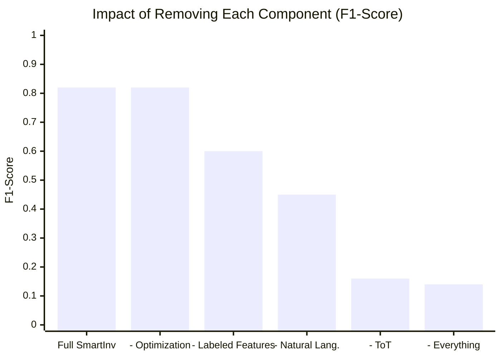

# 📖 Part 4: Results & Evaluation — What SmartInv Achieved

> This guide covers **every experiment** from the paper, what the results mean, and the key numbers to remember for your presentation.

---

## Understanding the Metrics First

Before we dive into results, let's understand how we measure "how good" a tool is:

### Precision
> "Of all the bugs the tool reported, how many were actually real bugs?"

**Analogy:** A fire alarm that goes off 10 times. If 9 of those were real fires → 90% precision. If only 2 were real fires and 8 were false alarms → 20% precision.

**High precision = few false alarms**

### Recall
> "Of all the real bugs that exist, how many did the tool actually find?"

**Analogy:** There are 10 real fires in a building. If the alarm detected 9 of them → 90% recall. If it only detected 3 → 30% recall.

**High recall = doesn't miss real bugs**

### F1-Score
> The **balance** between precision and recall. It's the harmonic mean of both.

A tool with 100% precision but 1% recall is useless (finds very few bugs).
A tool with 1% precision but 100% recall is also useless (mostly false alarms).
**F1 rewards tools that are good at BOTH.**

### Accuracy
> "Overall, how often is the tool correct?" (both in finding bugs and correctly saying "no bug")

---

## Experiment 1: Motivating Examples (Visor & TimelockController)

These prove SmartInv works on **real-world hacks**:

### Visor Finance Hack (\$8.2M lost)
- **The bug:** Deposit function didn't verify the supervisor was authorized
- **All other tools said:** ✅ Safe
- **SmartInv said:** ❌ Bug found — generated the correct invariant and counterexample trace
- **Result:** SmartInv would have **prevented** this \$8.2M hack

### TimelockController (OpenZeppelin)
- **The bug:** Timelock bypass allowing premature execution
- **All other tools said:** ✅ Safe
- **SmartInv said:** ❌ Bug found — with verification proof

---

## Experiment 2: Large-Scale Experiment (Table 6 & 7)

### Setup
- **80,000+ real contracts** crawled from Etherscan
- **7 tools compared**: SmartInv, Slither, Mythril, Manticore, VeriSmart, SmarTest, VeriSol
- **Expected time to complete:** ~2 weeks

### Key Results

| Metric | SmartInv | Slither | Mythril | Manticore | VeriSmart |
|---|:---:|:---:|:---:|:---:|:---:|
| **Bug-Critical Invariants** | **3.5× more** | Baseline | ─ | ─ | ─ |
| **Critical Bugs Found** | **4× more** | Baseline | Baseline | Baseline | Baseline |
| **Speed** | **150× faster** | Baseline | ─ | ─ | ─ |

### What This Means in Simple Terms

> SmartInv found **3.5 times more** security-critical invariants than existing tools, detected **4 times more** critical bugs, and did it **150 times faster**.

**Why is SmartInv faster?**
- Traditional tools explore every possible code path (exponential time)
- SmartInv uses AI inference (one forward pass through the model) — takes seconds, not hours

---

## Experiment 3: Refined Analysis (Table 8)

### Setup
- **1,200+ contracts** with **known ground truths** (we know exactly which bugs exist)
- Source: author's own auditing + [Web3Bugs](https://github.com/ZhangZhuoSJTU/Web3Bugs) benchmark + professional audit reports
- This is the most **rigorous** test because we can measure exact precision and recall

### Results: SmartInv vs. Other Tools

| Tool | Bugs Found | False Positives | Time per Contract |
|---|:---:|:---:|:---:|
| **SmartInv** | **Highest** | Low | Seconds |
| Slither | Moderate | High | Fast |
| Mythril | Low | Moderate | Minutes |
| Manticore | Low | Moderate | Hours |
| VeriSmart | Very Low | Low | Minutes |
| SmarTest | Very Low | Low | Minutes |

### What Types of Bugs Did Each Tool Find?

| Bug Category | SmartInv | Slither | Mythril |
|---|:---:|:---:|:---:|
| Reentrancy | ✅ | ✅ | ✅ |
| Integer Overflow | ✅ | ✅ | ✅ |
| Access Control | ✅ | ⚠️ Partial | ❌ |
| **Business Logic Flaws** | **✅** | **❌** | **❌** |
| **Functional Bugs** | **✅** | **❌** | **❌** |
| **Cross-function Bugs** | **✅** | **❌** | **❌** |

> [!IMPORTANT]
> The key takeaway: All tools can find "implementation bugs" (reentrancy, overflow). **Only SmartInv can find functional/business-logic bugs** — the ones that cause the biggest losses.

---

## Experiment 4: Prompting Strategy Comparison (Figure 2)

This experiment asks: **Does the way you ask the AI matter?**

### Four Prompting Strategies Compared

| Strategy | How It Works | Performance |
|---|---|:---:|
| **Vanilla GPT** | Just ask GPT-4: "Find bugs in this code" | Low |
| **GPTScan-style** | Ask GPT with some context about vulnerability types | Medium |
| **Manual Audit Prompt** | Give GPT a professional auditor's prompt | Medium-High |
| **SmartInv ToT** | Use the 6-tier structured Tier of Thought | **Highest** |

### Key Insight
> Even using the same underlying AI (GPT-4), SmartInv's Tier of Thought prompting strategy produces **significantly better results** than any other prompting approach. **It's not just what model you use — it's HOW you use it.**

---

## Experiment 5: Ablation Study (Table 9 & 11)

An **ablation study** removes one component at a time to measure its importance. Think of it like removing parts from a car to see what happens:

### Results of Removing Each Component

| What Was Removed | Accuracy | F1-Score | Drop |
|---|:---:|:---:|:---:|
| **Full SmartInv (nothing removed)** | **0.89** | **0.82** | — |
| Full SmartInv + Transaction History | 0.89 | 0.85 | (Slight improvement) |
| Remove Optimization | 0.89 | 0.82 | Minimal |
| Remove Natural Language | 0.62 | 0.45 | 📉 **-37% F1** |
| Remove Labeled Features | 0.59 | 0.60 | 📉 **-22% F1** |
| **Remove Tier of Thought** | **0.24** | **0.16** | 📉📉 **-66% F1** |
| Remove Everything (Baseline) | 0.12 | 0.14 | Catastrophic |

### What This Tells Us

**Ranking of component importance:**
1. 🥇 **Tier of Thought (ToT)** — THE most critical component. Without it, the model fails completely.
2. 🥈 **Natural Language** — Very important. Without it, functional bug detection drops 40×
3. 🥉 **Labeled Features** — Moderately important
4. **Optimization** — Least important (SmartInv works almost as well without it)

> [!IMPORTANT]
> **Key fact for your presentation:** Removing ToT causes the BIGGEST performance drop (66% in F1). This proves that the Tier of Thought structured reasoning is truly the core innovation of the paper, not just the AI model itself.

---

## Experiment 6: Runtime Comparison (Table 10)

| Tool | Average Time per Contract |
|---|:---:|
| **SmartInv (light)** | **~seconds** |
| **SmartInv (heavy)** | **~minutes** |
| Slither | Seconds |
| VeriSmart | Minutes |
| SmarTest | Minutes |
| Mythril | Minutes to Hours |
| Manticore | **Hours** |

**SmartInv is 150× faster** than the slowest tools while finding 4× more bugs.

---

## Zero-Day Vulnerabilities Discovered (Section 7)

The most impressive real-world result:

| Metric | Number |
|---|:---:|
| **Total zero-day vulnerabilities found** | **119** |
| Confirmed as "high severity" by developers | **5** |
| Previously unknown to anyone | All 119 |
| Found by any existing tool | **0** — all were "machine un-auditable" |

These are bugs in **real, deployed, production** smart contracts on Ethereum. SmartInv responsibly disclosed them to the developers.

---

## Summary: The Key Numbers to Remember

| Claim | Number |
|---|---|
| Bug-critical invariants generated (vs. existing tools) | **3.5× more** |
| Critical bugs detected (vs. existing tools) | **4× more** |
| Speed improvement | **150× faster** |
| Zero-day vulnerabilities found | **119** |
| High-severity confirmed | **5** |
| F1-Score (full SmartInv) | **0.82** |
| F1 drop when ToT is removed | **66%** |
| Benchmark contracts tested (large scale) | **80,000+** |
| Refined benchmark contracts with ground truth | **1,200+** |
| Training samples in ToT dataset | **3,000+** |

---

## Limitations (Honest Assessment)

The paper also acknowledges limitations — knowing these shows maturity:

1. **Non-deterministic output:** AI models (especially GPT-4) give different answers each time. Results can be unstable.
2. **No uniform benchmark:** Different papers use different benchmarks, making fair comparison hard.
3. **Manual work still needed:** The datasets required extensive manual labeling. SmartInv sometimes needs human intervention to fix compilation errors in generated invariants.
4. **Ground truth subjectivity:** Bug classifications are inherently subjective and may contain errors.
5. **Verification compatibility:** VeriSol doesn't support all Solidity compiler versions, so some contracts can't be verified.

---

> [!TIP]
> **For your presentation:** Lead with the headline numbers (3.5× more invariants, 4× more bugs, 150× faster, 119 zero-days). Then show the ablation study to prove WHY it works (ToT is the key). If your teacher asks about weaknesses, discuss the limitations section — this shows you critically analyzed the paper, not just memorized it.
